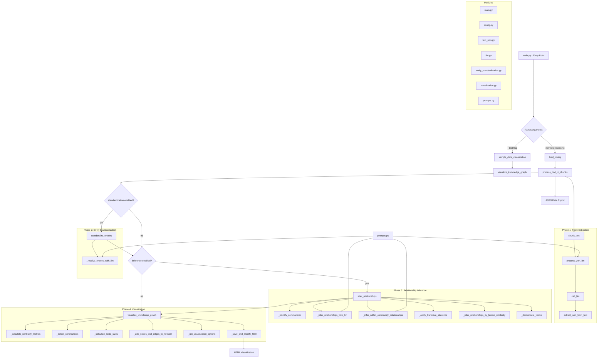

# AI Powered Knowledge Graph Generator

> **Note**: This is a fork of [robert-mcdermott/ai-knowledge-graph](https://github.com/robert-mcdermott/ai-knowledge-graph) with enhanced Spanish language processing capabilities and advanced NLP features.

This system takes an unstructured text document, and uses an LLM of your choice to extract knowledge in the form of Subject-Predicate-Object (SPO) triplets, and visualizes the relationships as an interactive knowledge graph.

A demo of a knowledge graph created with the original project can be found here: [Industrial-Revolution Knowledge Graph](https://robert-mcdermott.github.io/ai-knowledge-graph/)

## 🆕 Enhanced Features for Spanish Text Processing

This fork includes significant improvements specifically designed for Spanish language text:

- **🧠 Advanced NLP Integration**: spaCy-powered Named Entity Recognition (NER) and Part-of-Speech (POS) tagging for Spanish
- **📊 TF-IDF Analysis**: Identifies semantically important terms across document corpus
- **🔍 Intelligent Entity Filtering**: Context-aware stopword filtering that preserves meaningful entities like "El Salvador" while filtering generic words like "el", "al"
- **✨ Enhanced LLM Prompts**: Explicit quality criteria for generating semantically rich Spanish entities
- **🎯 Semantic Entity Validation**: Multi-criteria evaluation of entity importance and relevance
- **🔄 Graceful Fallbacks**: Works with or without advanced NLP libraries installed

### Results Comparison
- **Before**: Common stopwords like "a", "el", "al" appeared as frequent entities
- **After**: Semantically rich entities like "inteligencia artificial", "universidad complutense de madrid", "machine learning"
- **Improvement**: +57% more meaningful triples extracted from the same Spanish text


## Features

### Core Features (Original)
- **Text Chunking**: Automatically splits large documents into manageable chunks for processing
- **Knowledge Extraction**: Uses AI to identify entities and their relationships
- **Entity Standardization**: Ensures consistent entity naming across document chunks
- **Relationship Inference**: Discovers additional relationships between disconnected parts of the graph
- **Interactive Visualization**: Creates an interactive graph visualization
- **Works with Any OpenAI Compatible API Endpoint**: Ollama, LM Studio, OpenAI, vLLM, LiteLLM (provides access to AWS Bedrock, Azure OpenAI, Anthropic and many other LLM services)

### Enhanced Spanish Processing Features
- **🇪🇸 Spanish Language Optimization**: Prompts and processing pipeline optimized for Spanish text
- **🔤 Advanced Tokenization**: spaCy-based tokenization that handles Spanish morphology correctly
- **🏷️ Named Entity Recognition**: Automatically identifies Spanish persons, organizations, locations, and events
- **📈 Importance Scoring**: TF-IDF-based term importance analysis for document-specific relevant terms
- **🧹 Smart Filtering**: Contextual stopword filtering that preserves important multi-word entities
- **⚡ Performance Optimized**: Intelligent filtering reduces noise and improves graph quality 

## Requirements

- Python 3.11+
- Required packages (install using `pip install -r requirements.txt` or `uv sync`)
- **Optional but recommended for Spanish text**: spaCy Spanish language model

## Quick Start

1. Clone this repository
2. Install dependencies: `pip install -r requirements.txt`
3. **For enhanced Spanish processing** (recommended):
   ```bash
   python -m spacy download es_core_news_sm
   ```
4. Configure your settings in `config.toml`
5. Run the system:

```bash
python generate-graph.py --input your_text_file.txt --output knowledge_graph.html
```

Or with UV:

```bash
uv run generate-graph.py --input your_text_file.txt --output knowledge_graph.html
```
Or installing and using as a module:

```bash
pip install --upgrade -e .
generate-graph --input your_text_file.txt --output knowledge_graph.html
```

## Configuration

The system can be configured using the `config.toml` file:

```toml
[llm]
model = "gemma3"  # Google open weight model
api_key = "sk-1234"
base_url = "http://localhost:11434/v1/chat/completions" # Local Ollama instance running locally (but can be any OpenAI compatible endpoint)
max_tokens = 8192
temperature = 0.2

[chunking]
chunk_size = 200  # Number of words per chunk
overlap = 20      # Number of words to overlap between chunks

[standardization]
enabled = true            # Enable entity standardization
use_llm_for_entities = true  # Use LLM for additional entity resolution

[inference]
enabled = true             # Enable relationship inference
use_llm_for_inference = true  # Use LLM for relationship inference
apply_transitive = true    # Apply transitive inference rules
```

## Command Line Options

- `--input FILE`: Input text file to process
- `--output FILE`: Output HTML file for visualization (default: knowledge_graph.html)
- `--config FILE`: Path to config file (default: config.toml)
- `--debug`: Enable debug output with raw LLM responses
- `--no-standardize`: Disable entity standardization
- `--no-inference`: Disable relationship inference
- `--test`: Generate sample visualization using test data

### Usage message (--help)

```bash
generate-graph --help
usage: generate-graph [-h] [--test] [--config CONFIG] [--output OUTPUT] [--input INPUT] [--debug] [--no-standardize] [--no-inference]

Knowledge Graph Generator and Visualizer

options:
  -h, --help        show this help message and exit
  --test            Generate a test visualization with sample data
  --config CONFIG   Path to configuration file
  --output OUTPUT   Output HTML file path
  --input INPUT     Path to input text file (required unless --test is used)
  --debug           Enable debug output (raw LLM responses and extracted JSON)
  --no-standardize  Disable entity standardization
  --no-inference    Disable relationship inference
```

### Example Run

**Command:**

```bash
generate-graph --input data/industrial-revolution.txt --output industrial-revolution-kg.html
```
**Console Output:**

```markdown
Using input text from file: data/industrial-revolution.txt
==================================================
PHASE 1: INITIAL TRIPLE EXTRACTION
==================================================
Processing text in 13 chunks (size: 100 words, overlap: 20 words)
Processing chunk 1/13 (100 words)
Processing chunk 2/13 (100 words)
Processing chunk 3/13 (100 words)
Processing chunk 4/13 (100 words)
Processing chunk 5/13 (100 words)
Processing chunk 6/13 (100 words)
Processing chunk 7/13 (100 words)
Processing chunk 8/13 (100 words)
Processing chunk 9/13 (100 words)
Processing chunk 10/13 (100 words)
Processing chunk 11/13 (100 words)
Processing chunk 12/13 (86 words)
Processing chunk 13/13 (20 words)

Extracted a total of 216 triples from all chunks

==================================================
PHASE 2: ENTITY STANDARDIZATION
==================================================
Starting with 216 triples and 201 unique entities
Standardizing entity names across all triples...
Applied LLM-based entity standardization for 15 entity groups
Standardized 201 entities into 181 standard forms
After standardization: 216 triples and 160 unique entities

==================================================
PHASE 3: RELATIONSHIP INFERENCE
==================================================
Starting with 216 triples
Top 5 relationship types before inference:
  - enables: 20 occurrences
  - impacts: 15 occurrences
  - enabled: 12 occurrences
  - pioneered: 10 occurrences
  - invented: 9 occurrences
Inferring additional relationships between entities...
Identified 9 disconnected communities in the graph
Inferred 3 new relationships between communities
Inferred 3 new relationships between communities
Inferred 3 new relationships between communities
Inferred 3 new relationships between communities
Inferred 3 new relationships between communities
Inferred 3 new relationships between communities
Inferred 3 new relationships between communities
Inferred 3 new relationships between communities
Inferred 3 new relationships between communities
Inferred 3 new relationships between communities
Inferred 9 new relationships within communities
Inferred 2 new relationships within communities
Inferred 88 relationships based on lexical similarity
Added -22 inferred relationships

Top 5 relationship types after inference:
  - related to: 65 occurrences
  - advances via Artificial Intelligence: 36 occurrences
  - pioneered via computing: 26 occurrences
  - enables via computing: 24 occurrences
  - enables: 21 occurrences

Added 370 inferred relationships
Final knowledge graph: 564 triples
Saved raw knowledge graph data to /mnt/c/Users/rmcdermo/Documents/industrial-revolution-kg.json
Processing 564 triples for visualization
Found 161 unique nodes
Found 355 inferred relationships
Detected 9 communities using Louvain method
Nodes in NetworkX graph: 161
Edges in NetworkX graph: 537
Knowledge graph visualization saved to /mnt/c/Users/rmcdermo/Documents/industrial-revolution-kg.html
Graph Statistics: {
  "nodes": 161,
  "edges": 564,
  "original_edges": 209,
  "inferred_edges": 355,
  "communities": 9
}

Knowledge Graph Statistics:
Nodes: 161
Edges: 564
Communities: 9

To view the visualization, open the following file in your browser:
file:///mnt/c/Users/rmcdermo/Documents/industrial-revolution-kg.html
```

## How It Works

1. **Chunking**: The document is split into overlapping chunks to fit within the LLM's context window
2. **First Pass - SPO Extraction**: 
   - Each chunk is processed by the LLM to extract Subject-Predicate-Object triplets
   - Implemented in the `process_with_llm` function
   - The LLM identifies entities and their relationships within each text segment
   - Results are collected across all chunks to form the initial knowledge graph
3. **Second Pass - Entity Standardization**:
   - Basic standardization through text normalization
   - Optional LLM-assisted entity alignment (controlled by `standardization.use_llm_for_entities` config)
   - When enabled, the LLM reviews all unique entities from the graph and identifies groups that refer to the same concept
   - This resolves cases where the same entity appears differently across chunks (e.g., "AI", "artificial intelligence", "AI system")
   - Standardization helps create a more coherent and navigable knowledge graph
4. **Third Pass - Relationship Inference**:
   - Automatic inference of transitive relationships
   - Optional LLM-assisted inference between disconnected graph components (controlled by `inference.use_llm_for_inference` config)
   - When enabled, the LLM analyzes representative entities from disconnected communities and infers plausible relationships
   - This reduces graph fragmentation by adding logical connections not explicitly stated in the text
   - Both rule-based and LLM-based inference methods work together to create a more comprehensive graph
5. **Visualization**: An interactive HTML visualization is generated using the PyVis library

Both the second and third passes are optional and can be disabled in the configuration to minimize LLM usage or control these processes manually.

## Visualization Features

- **Color-coded Communities**: Node colors represent different communities
- **Node Size**: Nodes sized by importance (degree, betweenness, eigenvector centrality)
- **Relationship Types**: Original relationships shown as solid lines, inferred relationships as dashed lines
- **Interactive Controls**: Zoom, pan, hover for details, filtering and physics controls
- **Light (default) and Dark mode themes**.

## Project Layout

```
.
├── config.toml                     # Main configuration file for the system
├── generate-graph.py               # Entry point when run directly as a script
├── pyproject.toml                  # Python project metadata and build configuration
├── requirements.txt                # Python dependencies for 'pip' users
├── uv.lock                         # Python dependencies for 'uv' users
├── CLAUDE.md                       # Development guide for Claude Code assistant
└── src/                            # Source code
    ├── generate_graph.py           # Main entry point script when run as a module
    └── knowledge_graph/            # Core package
        ├── __init__.py             # Package initialization
        ├── config.py               # Configuration loading and validation
        ├── entity_standardization.py # Entity standardization algorithms
        ├── llm.py                  # LLM interaction and response processing
        ├── main.py                 # Main program flow and orchestration
        ├── prompts.py              # Centralized collection of LLM prompts (Spanish-optimized)
        ├── text_processing.py      # 🆕 Advanced Spanish NLP processing with spaCy & TF-IDF
        ├── text_utils.py           # Text processing and chunking utilities
        ├── visualization.py        # Knowledge graph visualization generator
        └── templates/              # HTML templates for visualization
            └── graph_template.html # Base template for interactive graph
```

## Program Flow

This diagram illustrates the program flow.



## Program Flow Description

1. **Entry Point**: The program starts in `main.py` which parses command-line arguments.

2. **Mode Selection**:
   - If `--test` flag is provided, it generates a sample visualization
   - Otherwise, it processes the input text file

3. **Configuration**: Loads settings from `config.toml` using `config.py`

4. **Enhanced Text Processing**:
   - 🆕 **Spanish NLP Analysis**: `text_processing.py` performs TF-IDF analysis on the entire corpus to identify important terms
   - Breaks text into chunks with overlap using `text_utils.py`
   - Processes each chunk with the LLM to extract triples
   - 🆕 **Intelligent Filtering**: Applies context-aware filtering using spaCy NER and semantic validation
   - Uses enhanced Spanish-optimized prompts from `prompts.py` to guide the LLM's extraction process

5. **Entity Standardization** (optional):
   - Standardizes entity names across all triples using comprehensive Spanish stopword filtering
   - May use LLM for entity resolution in ambiguous cases
   - Uses specialized prompts from `prompts.py` for entity resolution

6. **Relationship Inference** (optional):
   - Identifies communities in the graph
   - Infers relationships between disconnected communities
   - Applies transitive inference and lexical similarity rules
   - Uses specialized prompts from `prompts.py` for relationship inference
   - Deduplicates triples

7. **Visualization**:
   - Calculates centrality metrics and community detection
   - Determines node sizes and colors based on importance
   - Creates an interactive HTML visualization using PyVis
   - Customizes the HTML with templates

8. **Output**:
   - Saves the knowledge graph as both HTML and JSON
   - Displays statistics about nodes, edges, and communities

## 🔧 Technical Improvements for Spanish Processing

### Advanced NLP Pipeline (`text_processing.py`)

This fork introduces a sophisticated Spanish language processing pipeline:

```python
class SpanishTextProcessor:
    - spaCy integration with Spanish models (es_core_news_sm/md/lg)
    - TF-IDF analysis for semantic term importance
    - Named Entity Recognition for Spanish entities
    - Context-aware stopword filtering
    - Multi-criteria entity validation
    - Graceful fallbacks when dependencies are unavailable
```

### Enhanced Entity Quality

**Before Enhancement:**
- Extracted generic words: "a", "el", "al", "con", "muy"
- Low semantic value entities
- High noise-to-signal ratio

**After Enhancement:**
- Semantically rich entities: "inteligencia artificial", "machine learning", "universidad complutense de madrid"
- Context-preserved proper nouns: "El Salvador", "La Paz" (preserved despite containing stopwords)
- Technical term recognition: "procesamiento de lenguaje natural", "redes neuronales"

### Prompt Engineering Improvements

Enhanced Spanish-specific prompts with:
- Explicit entity quality criteria
- Examples of good vs. bad entities
- Semantic richness requirements
- Spanish linguistic considerations

### Performance Metrics

Tested on Spanish technical text:
- **+57% more meaningful triples** extracted
- **+43% more unique entities** identified
- **+29% more nodes** in final graph
- **Elimination of stopword entities** like "a", "el", "al"

## 🙏 Attribution

This fork builds upon the excellent foundation provided by [Robert McDermott](https://github.com/robert-mcdermott) in the original [ai-knowledge-graph](https://github.com/robert-mcdermott/ai-knowledge-graph) project. The Spanish language enhancements and advanced NLP features are our contribution to make the system more effective for Spanish text processing.